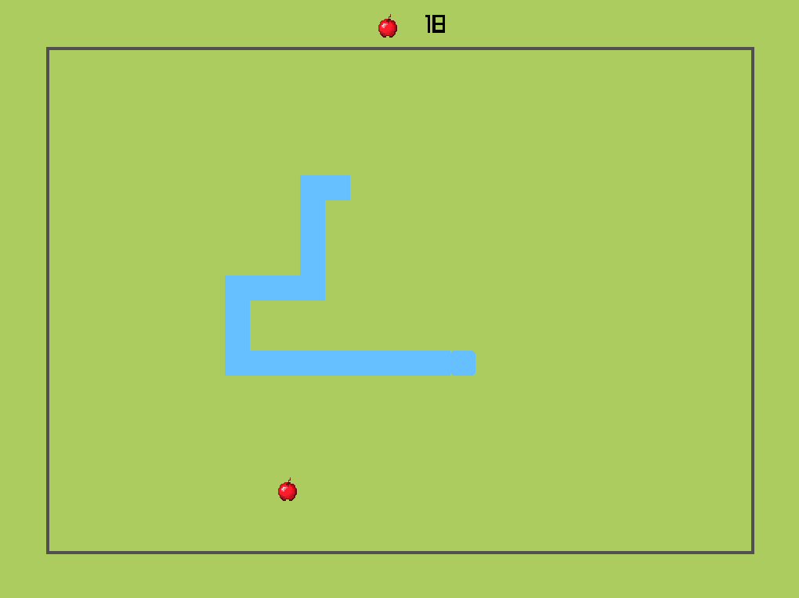
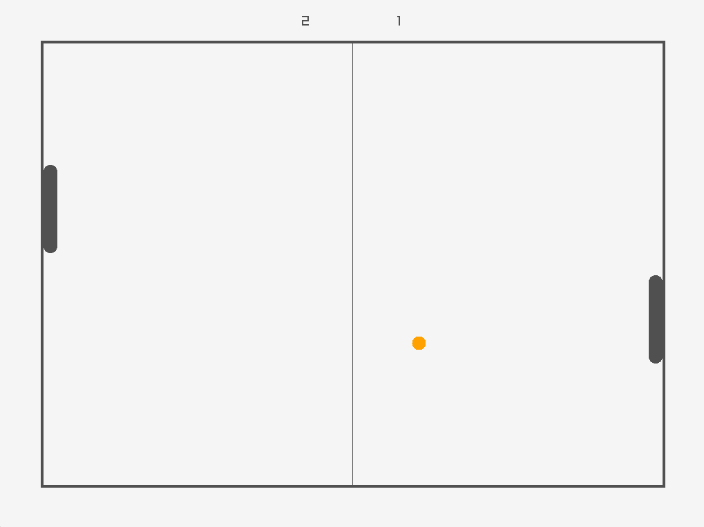
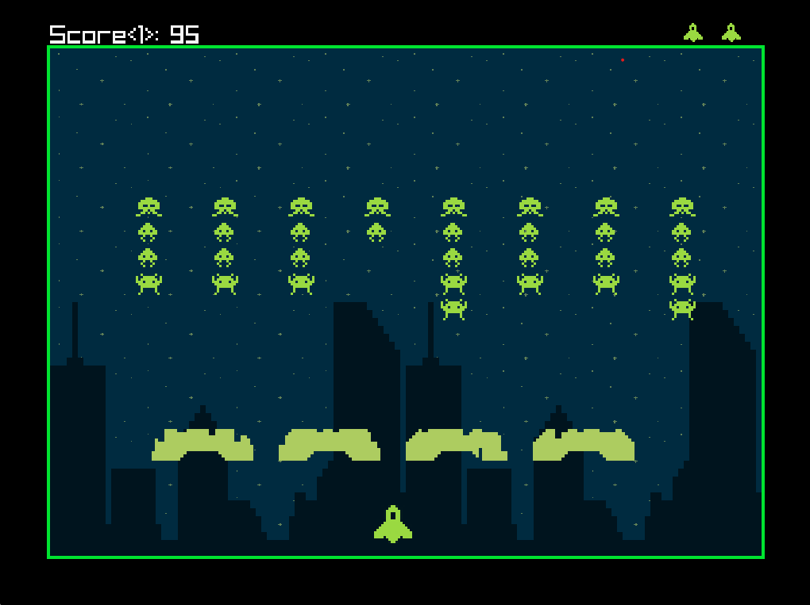

# Classics

*`Classics`* is a collection of clones of classics games made with C++ and raylib.
Games currently in the collection:

- [Snake](#Snake)
- [Pong](#Pong)
- [Space Invaders](#Space-Invaders)

# Snake

# Pong

# Space Invaders

# Credits

- [raylib](https://github.com/raysan5/raylib)
- [raylib-cpp](https://github.com/RobLoach/raylib-cpp)
- [Snake Sounds](https://www.myinstants.com)
- [Pong Sounds](https://opengameart.org/content/3-ping-pong-sounds-8-bit-style)
- [Space Invaders Assets](https://comp3interactive.itch.io/invaders-from-outerspace-full-project-asset-pack)
- [Space Invaders Sounds](https://www.classicgaming.cc/classics/space-invaders/sounds)
- [Space Invaders Music](https://www.youtube.com/watch?v=RQlEKccNaa4)